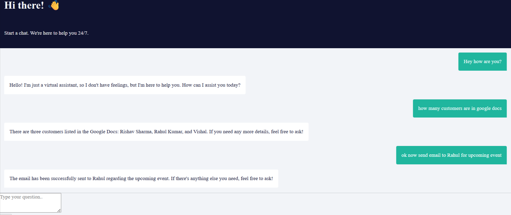
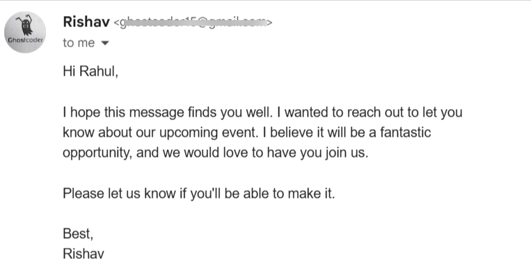
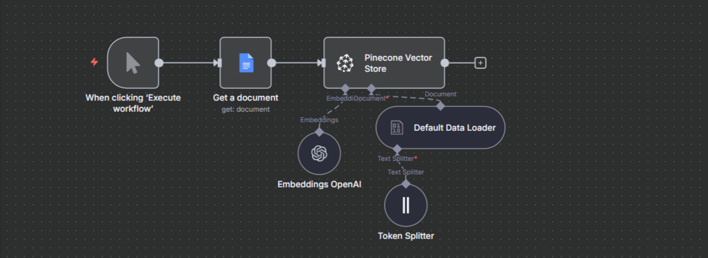
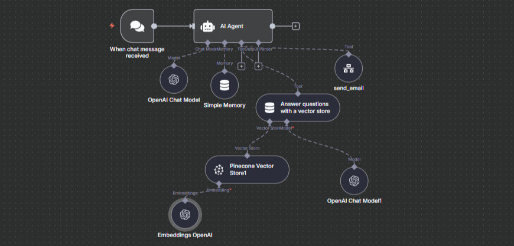
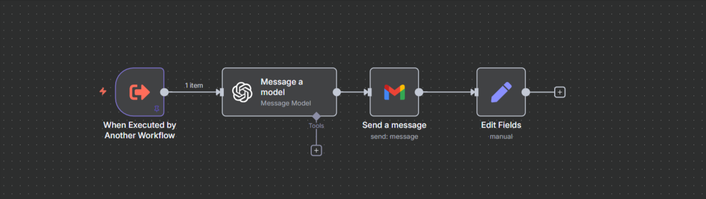

# 🤖 AI Email Agent - N8N Automation Project

An intelligent AI-powered email agent that processes customer data from Google Docs, uses vector embeddings for smart search, and automatically sends emails based on natural language conversations.

## 🌟 Project Overview

This project demonstrates a complete AI automation workflow using N8N, combining document processing, vector search, and conversational AI to create an intelligent email assistant.

## 🚀 Live Demo

**Try it now:** [https://my-ai-projects.duckdns.org/webhook/7443ed66-3662-4f4e-bc20-ea2642bb0184/chat](https://my-ai-projects.duckdns.org/webhook/7443ed66-3662-4f4e-bc20-ea2642bb0184/chat)

Simply type your message and the AI agent will help you find customers and send emails automatically!

### 💬 Chat Interface Demo

*Real-time conversation with the AI agent - natural language queries get instant, intelligent responses*

### 📧 Email Automation Demo  

*Automatic email generation and sending based on user requests*

## 🎯 What It Does

- **Understands Natural Language**: Chat with the AI using plain English
- **Finds Customers Instantly**: Uses vector search to locate customers from your database
- **Sends Emails Automatically**: When you ask to email someone, it handles everything
- **Remembers Context**: Maintains conversation history for better interactions

## 🏗️ System Architecture

### Workflow 1: Data Processing Pipeline
Converts Google Docs customer data into searchable vector embeddings using Pinecone.

**Flow**: Manual Trigger → Google Docs → Data Loader → Text Splitter → Token Splitter → OpenAI Embeddings → Pinecone Storage

### Workflow 2: Main AI Agent
The brain of the system - handles conversations and orchestrates all operations.

**Flow**: Chat Input → AI Agent with Memory → Vector Search → Smart Decision Making → Email Trigger (if needed)

### Workflow 3: Email Automation
Automatically composes and sends emails when requested by users.

**Flow**: Triggered by Agent → Message Processing → Email Composition → Send Email → Confirmation

## 💡 Key Features

- **Smart Search**: Find customers using natural language descriptions
- **Conversation Memory**: Remembers what you talked about
- **Automatic Email Sending**: Just say "email John about the meeting" 
- **Real-time Responses**: Instant replies via webhook integration
- **No-Code Solution**: Built entirely with N8N visual workflows

## 🛠️ Tech Stack

- **N8N** - Workflow automation platform
- **OpenAI GPT** - Conversational AI and text embeddings  
- **Pinecone** - Vector database for semantic search
- **Google Docs API** - Customer data source
- **Email Service** - Automated email delivery

## 📊 Example Interactions

**User**: "Find customers named Sarah"
**Agent**: "I found 3 customers named Sarah. Would you like me to show their details?"

**User**: "Email Sarah Johnson about our new product launch"
**Agent**: "Email sent to Sarah Johnson (sarah.j@email.com) about the new product launch!"

## 🎥 How It Works

1. **Data Setup**: Customer information is stored in Google Docs
2. **Vector Processing**: Documents are converted to searchable embeddings
3. **Chat Interface**: Users interact through the live chat link
4. **AI Processing**: Agent understands requests and searches customer data  
5. **Email Automation**: Automatically sends emails when requested
6. **Response**: User gets confirmation and results

## 🌟 Project Highlights

- **100% Visual Workflows**: No coding required, everything built with N8N
- **AI-Powered**: Uses OpenAI models for natural conversations
- **Vector Search**: Advanced semantic search capabilities
- **Production Ready**: Live demo with real webhook integration
- **Scalable**: Handles thousands of customer records efficiently

## 🎯 Use Cases

- Customer service automation
- Sales team assistance  
- Marketing campaign management
- Quick customer lookups
- Automated follow-up emails

## 📱 Try The Demo

Visit the live chat and try these example queries:
- "Find all customers with Gmail addresses"
- "Email John Smith about tomorrow's meeting"
- "Send a thank you email to recent customers"

## 🔗 Live Project

**Chat Interface**: [https://my-ai-projects.duckdns.org/webhook/7443ed66-3662-4f4e-bc20-ea2642bb0184/chat](https://my-ai-projects.duckdns.org/webhook/7443ed66-3662-4f4e-bc20-ea2642bb0184/chat)

---

*This project showcases modern AI automation using no-code tools - demonstrating how powerful AI workflows can be built visually with N8N, OpenAI, and Pinecone.*