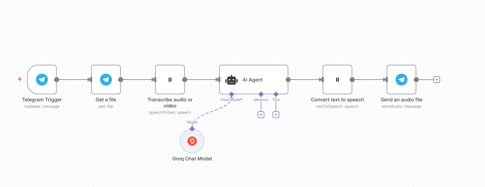
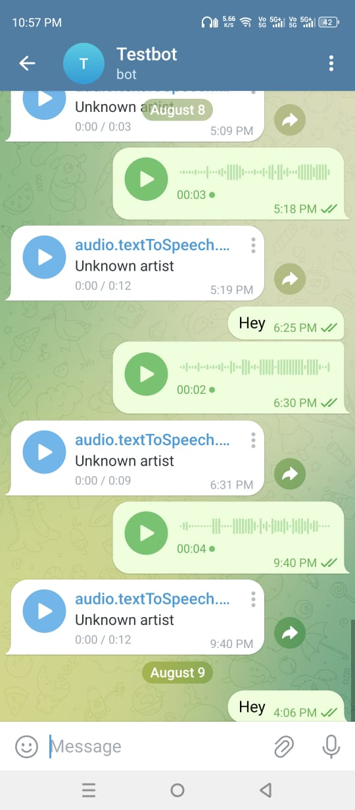

# Telegram Voice Assistant – @Gairolatech_bot

This workflow powers **@Gairolatech_bot**, a Telegram-based **voice AI assistant**.  
It listens to voice messages, transcribes them, processes them with an AI model, and responds back in natural-sounding speech.

---

## **How It Works**

1. **Voice Input (Telegram Trigger)**  
   You send a voice message to **@Gairolatech_bot**.

2. **Download Audio (Get a file)**  
   The bot fetches your voice message from Telegram.

3. **Speech-to-Text (ElevenLabs)**  
   The audio is transcribed into text.

4. **AI Response (Groq Chat Model – llama3-8b-8192)**  
   The text is processed by an AI agent using Groq’s fast and accurate **LLaMA3-8B** model.

5. **Text-to-Speech (ElevenLabs)**  
   The AI’s reply is converted into natural speech.

6. **Send Audio Back (Telegram)**  
   The bot sends you the generated audio reply in Telegram.

---

## **Workflow Diagram**
  
*Example: The n8n workflow powering this bot*

---

## **Bot Demo**
  
*Example conversation with @Gairolatech_bot*

---

## **Features**
- **Voice-first interaction** – talk to AI without typing.
- **High-quality transcription & speech** – powered by ElevenLabs.
- **Fast AI responses** – using Groq’s optimized LLaMA3-8B model.
- **Seamless Telegram integration** – just send a voice note to **@Gairolatech_bot**.

---

## **Workflow Summary**
🎤 Telegram Voice → 📥 Download → 📝 Transcribe → 🤖 AI Agent (LLaMA3) → 🔊 Text-to-Speech → 📤 Send to Telegram

---

## **Bot Username**
[@Gairolatech_bot](https://t.me/Gairolatech_bot)

